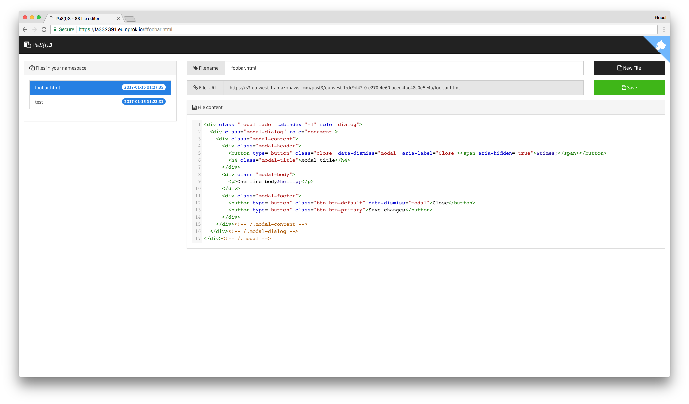

# Luzifer / PaS(t)3

PaS(t)3 is a S3 file editor with Google authentication using Amazon Cognito. It does not require a server to run but can be deployed into a S3 bucket. Files edited are also stored in a (possibly the same) S3 bucket.

## Setup

1. Create a project in the [Google Cloud Console](https://console.cloud.google.com/)
  1. Add an oAuth consent screen for your application (API Manager -> Credentials)
  1. Create credentials for a "Web application", add your URL as an "Authorized JavaScript origin"
  1. Put Client Id into the `config.yml`
1. Create a S3 bucket and add the CORS policy
1. Create an Amazon Cognito Federated Identity Pool
  1. Add the policy documented in `cognito_auth_policy.json` as "Authenticated Role"
  1. Set the Google Client ID in the Google+ tab in "Authentication providers"
  1. Note down the Idenitiy Pool ID in the `config.yml`
1. Go through the `config.yml` and adjust parameters
1. You may need to execute `pip install -r requirements.txt` as next step needs three python modules
1. Execute `make` which will generate a `public` folder with all required files
1. Upload the contents of the `public` folder

## Used technology

- [Amazon Cognito](https://aws.amazon.com/cognito/)
- [Amazon S3](https://aws.amazon.com/s3/)
- [Bootstrap](http://getbootstrap.com/)
- [Bootswatch Theme](https://bootswatch.com/)
- [CodeMirror Editor](https://codemirror.net/)
- [Font Awesome Icons](http://fontawesome.io/)
- [Google+ Login](https://developers.google.com/+/web/signin/)
